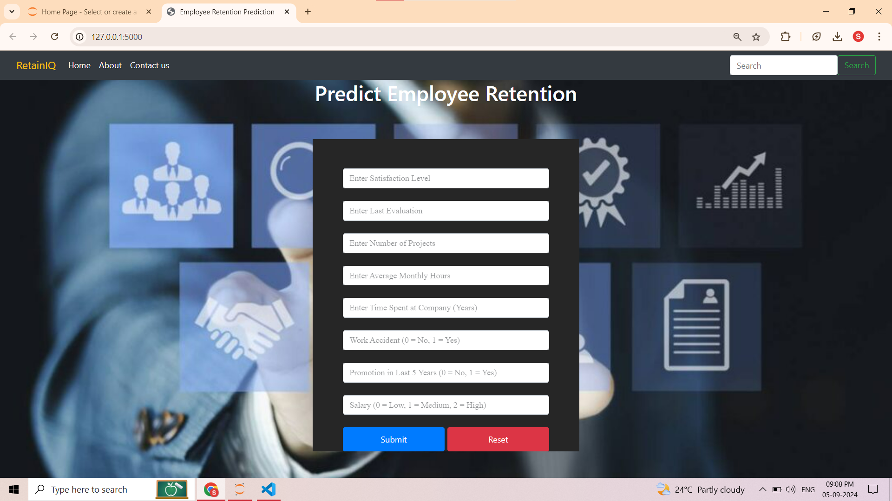

# 📊 RetainIQ: An Employee Retention System using ML 🤖

Welcome to **RetainIQ**! This application leverages machine learning to predict employee retention and provide insights into workforce management. 🧑‍💼📈

## 🚀 Features

- **Model Training**: Train your model using historical data.
- **Batch Prediction**: Make predictions on batches of data.
- **Single Prediction**: Get predictions for individual employee data.

## 🌟 Getting Started

### Prerequisites

Make sure you have the following installed:

- Python 3.x
- Flask
- Flask-CORS
- Flask-MonitoringDashboard
- pandas
- Other dependencies specified in `requirements.txt`

### Installation

1. Clone this repository:

    ```bash
    git clone https://github.com/yourusername/retainiq.git
    ```

2. Navigate to the project directory:

    ```bash
    cd retainiq
    ```

3. Install the required packages:

    ```bash
    pip install -r requirements.txt
    ```

### Running the Application

1. Start the Flask server:

    ```bash
    python app.py
    ```

2. Access the application at `http://127.0.0.1:5000`.

## 📋 API Endpoints

- **`/`**: Displays the main HTML page.
- **`/training`**: POST request to initiate model training.
- **`/batchprediction`**: POST request for batch predictions.
- **`/prediction`**: POST request for single predictions.

## 🖼️ Screenshot

Here's a preview of the application:



## 🛠️ Configuration

Adjust the configuration in `app/core/config.py` to match your data paths and settings.

## 💡 Contributing

Contributions are welcome! Please submit a pull request or open an issue for any suggestions or bug reports.

## 📄 License

This project is licensed under the MIT License - see the [LICENSE](LICENSE) file for details.

---

Happy predicting! 😊
